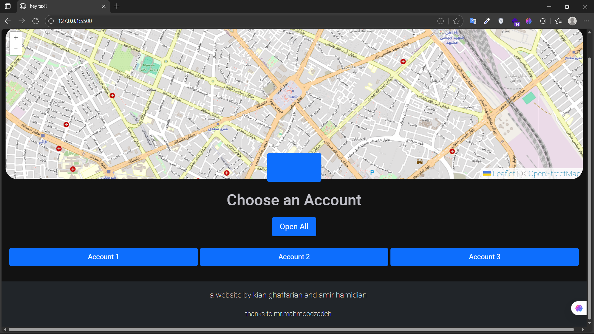
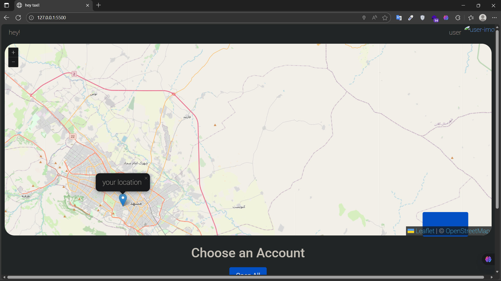
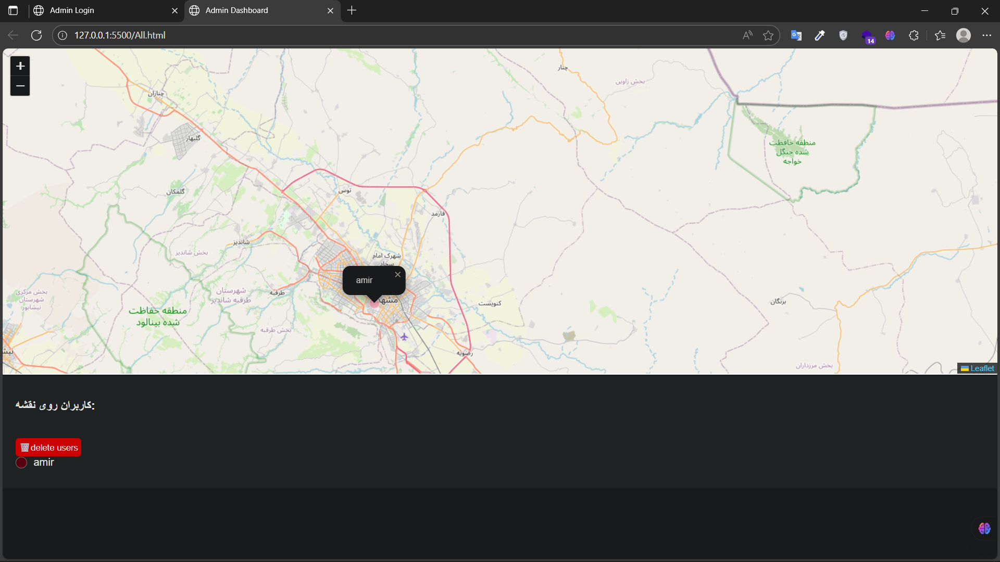

### 🚖 TaxiApp

A modern, responsive ride-hailing web/mobile application inspired by Uber-like services — enabling users to request rides, track drivers, and enjoy a seamless travel experience.

---

### 🚀 Features
- 🧭 User-friendly booking interface: choose pickup & drop-off locations  
- 📍 Driver tracking and location updates  
- 📱 Fully responsive (desktop + mobile)  
- 🎨 Clean and minimal UI for efficient booking

---

### 🖼️ Screenshots
<p align="center">
  
  
  
</p>

---

### ⚙️ Installation & Run

```bash
git clone https://github.com/VibelessYoung/TaxiApp.git
cd TaxiApp
